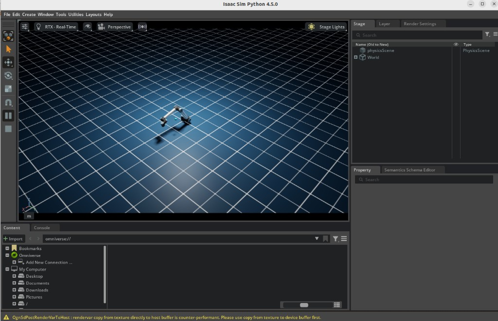
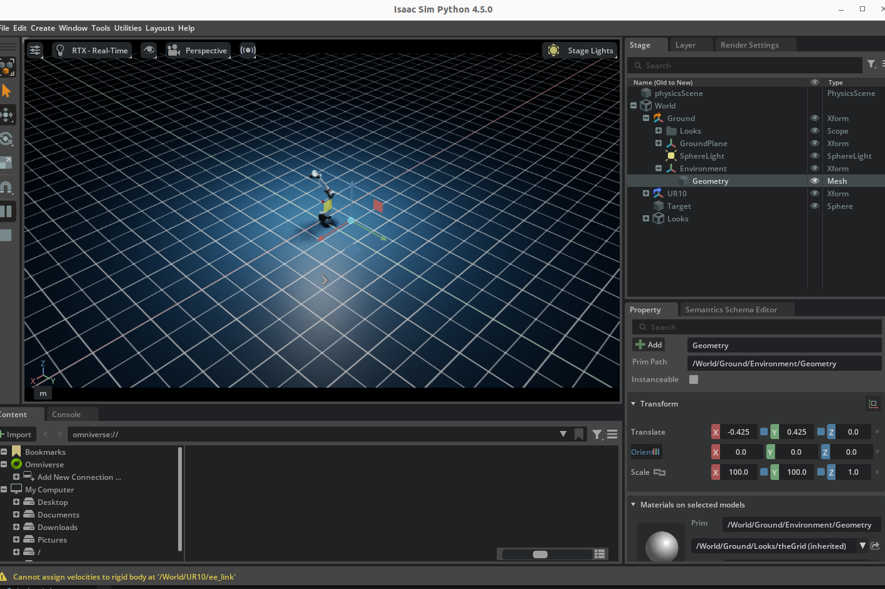
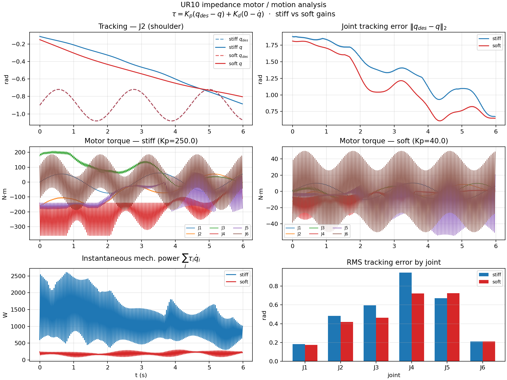
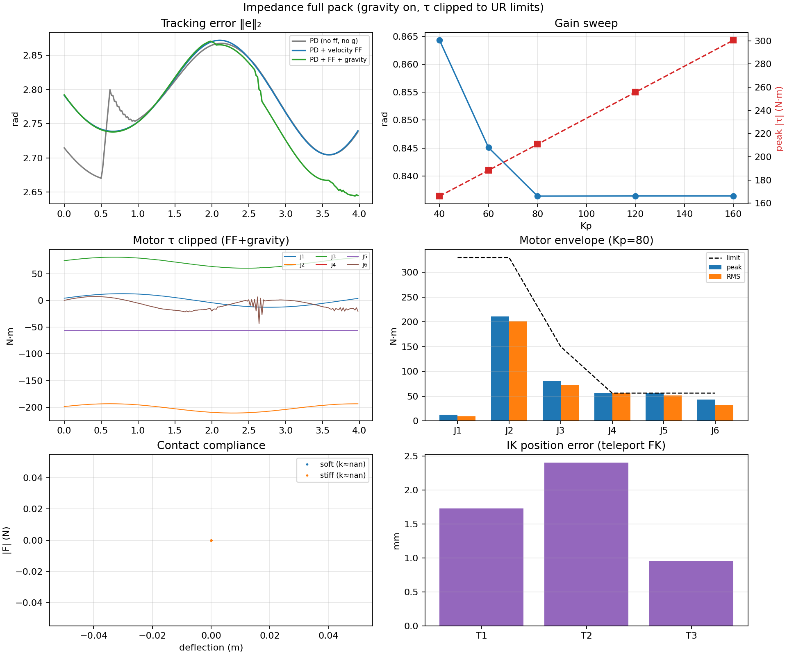
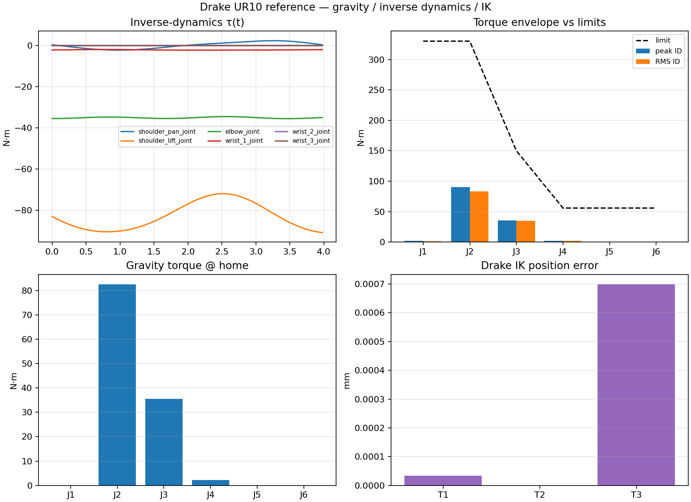
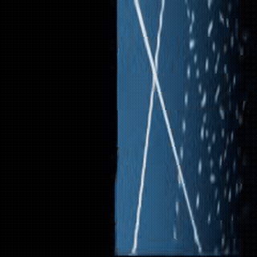

# isaacsim-ur-rl

[](LICENSE)
[](https://developer.nvidia.com/isaac-sim)
[](https://python.org)

Reinforcement learning for UR arm reach and pick-and-place tasks in **NVIDIA Isaac Sim**, using **SAC** (Stable Baselines 3) with a custom gym environment backed by the Isaac Sim physics engine.





---

## What it does

- Trains a SAC policy to control a UR10 arm to reach randomized 3-D targets in Isaac Sim
- Multi-arm variant (`ur_reach_multi_env.py`) for parallel training across several robot instances
- Saves checkpoints every 50k steps; best model saved automatically via `EvalCallback`
- Runs trained policies in visual or headless mode

---

## Impedance & motor analysis

Effort-mode joint impedance on the UR10, with stiff/soft gain comparison and a fuller tracking / torque / compliance / IK pack. Cross-checked with **Drake** inverse dynamics on the same UR10 URDF.



*Stiff vs soft impedance: tracking error, motor torque, and mechanical power (`analyze_impedance_motors.py`).*



*Isaac full pack with gravity enabled and τ clipped to UR max efforts (`analyze_impedance_full_pack.py`).*



*Drake reference: gravity, inverse-dynamics torque envelope vs datasheet limits, IK (`analyze_dynamics_drake.py`).*

```bash
OMNI_KIT_ACCEPT_EULA=YES .venv/bin/python -u analyze_impedance_motors.py --headless
OMNI_KIT_ACCEPT_EULA=YES .venv/bin/python -u analyze_impedance_full_pack.py --headless
.venv/bin/python -u analyze_dynamics_drake.py   # no Isaac / GPU needed
```

---

## Structure

```
isaacsim-ur-rl/
├── train.py              # SAC training entry point
├── run_policy.py         # Load and visualize a trained policy
├── envs/
│   ├── ur_reach_env.py       # Single UR10 gym environment
│   └── ur_reach_multi_env.py # Multi-robot variant
├── configs/
│   └── sac_reach.yaml    # Hyperparameters and env config
├── models/               # Saved policy checkpoints (gitignored)
└── logs/                 # TensorBoard training logs
```

---

## Requirements

- NVIDIA Isaac Sim 4.x (via Omniverse launcher or pip install)
- Python 3.10+
- CUDA-capable GPU

```bash
pip install -r requirements.txt
```

---

## Train

```bash
# Headless (faster)
python train.py --headless --timesteps 1000000

# With GUI
python train.py --timesteps 500000

# Custom config
python train.py --headless --config configs/sac_reach.yaml
```

Checkpoints saved to `models/`. Best model: `models/best_model.zip`.

---

## Run a Trained Policy

```bash
python run_policy.py --model models/best_model.zip --episodes 10

# Headless inference
python run_policy.py --model models/best_model.zip --headless
```

---

## Config

Edit `configs/sac_reach.yaml` to tune hyperparameters:

```yaml
policy: MlpPolicy
learning_rate: 0.0003
buffer_size: 300000
batch_size: 256
gamma: 0.99
tau: 0.005
ent_coef: auto
train_freq: 1
gradient_steps: 1
learning_starts: 5000
eval_freq: 20000
n_eval_episodes: 10

env:
  action_scale: 0.3
  target_radius: 0.05
  reach_bonus: 10.0
  max_episode_steps: 500
```

---

## Force-Aware VLA Extension

Adds contact-force sensing and a fine-tuning pipeline on top of the reach task, toward fine-tuning an existing VLA/manipulation policy (LeRobot's ACT, then SmolVLA) rather than designing a new architecture from scratch.



*Wrist-camera view from `collect_data.py`, 224×224 @ recorded fps — scene lighting is a known rough edge, not a rendering bug.*

- **`envs/ur_force_env.py`** — `URForceReachEnv`, a 21-dim-observation variant of `URReachEnv` adding wrist contact force (via `RigidContactView`, force-only in v1) and two `control_mode`s: `"position"` (drive-based, with optional virtual-compliance `impedance_gain`) and `"impedance"` (true torque control: `switch_control_mode("effort")` + a manually computed `tau = Kp*(q_des-q) + Kd*(0-qdot)`, gains in `configs/env_force_reach.yaml`). Both modes command through `apply_action(...)` rather than `set_joint_positions()` (which teleports rather than physically drives — see `robocloud.md` for details), so contact/impedance behavior is physically grounded.
- **`collect_data.py`** — rolls out episodes using a scripted reach-to-target controller (proportional base-yaw + bang-bang shoulder/elbow, tracking `dist`-to-target; not Isaac Sim's `RMPFlowController`, whose preset config was found to mismatch this gripper-less robot — see `robocloud.md`) and dumps raw `.npz` episodes to disk (state + wrist RGB + action + task instruction). Runs under this repo's own `.venv` (Python 3.10).
- **`package_dataset.py`** — reads those raw `.npz` files and builds a real `LeRobotDataset`. Runs under `.venv312` (Python 3.12, see below) — **not** the Isaac Sim `.venv`.
- **`train_act.py`** — thin wrapper around LeRobot's `lerobot-train` CLI to fine-tune ACT on the packaged dataset. No LeRobot core changes needed — force channels ride along as extra `observation.state` dims. Runs under `.venv312`.
- **`run_policy_act.py`** — closed-loop evaluation of the fine-tuned ACT policy in Isaac Sim (mirrors `run_policy.py`'s structure).
- **`configs/env_force_reach.yaml`, `configs/act_train.yaml`, `configs/smolvla_train.yaml`** — env/training configs; SmolVLA is a documented phase-2 stretch goal, not wired to a training script yet.

**Two Python versions are required** — Isaac Sim is fixed at 3.10, but `lerobot` requires >=3.12 and pins an older torch, so it can't be installed into the Isaac Sim `.venv`. One-time setup for a second venv:

```bash
virtualenv -p python3.12 .venv312   # stdlib `venv` needs python3.12-venv (ensurepip),
                                     # which may be missing; virtualenv sidesteps that
.venv312/bin/pip install -e "../lerobot[dataset]"
```

```bash
# 1. Record raw episodes (Isaac Sim .venv, py3.10)
.venv/bin/python collect_data.py --headless --config configs/env_force_reach.yaml

# 2. Package into a LeRobotDataset (.venv312, py3.12)
.venv312/bin/python package_dataset.py --config configs/env_force_reach.yaml

# 3. Fine-tune ACT (.venv312, py3.12)
.venv312/bin/python train_act.py --config configs/act_train.yaml

# 4. Evaluate closed-loop (Isaac Sim .venv, py3.10 -- see Status below)
.venv/bin/python run_policy_act.py --checkpoint outputs/act_v0/checkpoints/last --headless
```

**Viewing collected data**: `package_dataset.py` writes the wrist-camera footage as a standard mp4, playable in any video player:
`datasets/<output_root>/videos/observation.images.wrist/chunk-000/file-000.mp4` (all episodes concatenated back-to-back, 224×224 @ the configured fps).

Status: steps 1–3 verified working end-to-end on a real 20-episode run — data collected, packaged (14,820 frames), and a 3000-step ACT training run's loss dropped from ~12.5 to ~0.8. Step 4 has an unresolved architecture problem: `run_policy_act.py` needs to load an `ACTPolicy` (lerobot, py3.12) *inside* the Isaac Sim loop (py3.10) — the same version conflict, but this time there's no simple "write to disk and read separately" split since it's live inference. Needs its own design (e.g. IPC to a persistent `.venv312` subprocess, or reimplementing ACT inference with only `torch`) before milestone 4.

---

## Author

**darshmenon** — [github.com/darshmenon](https://github.com/darshmenon)
